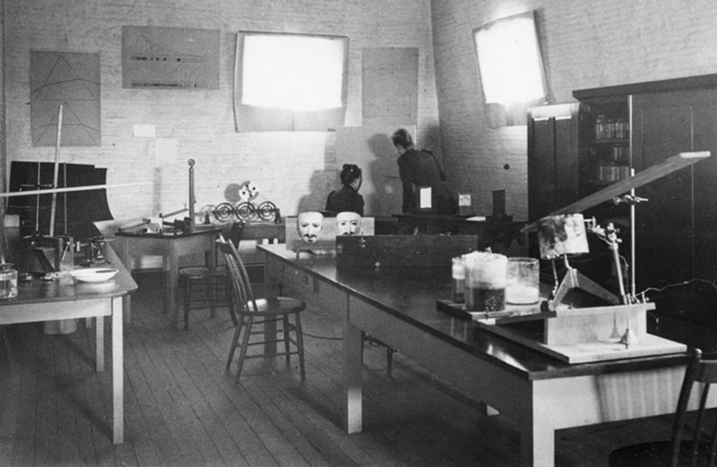

# 0 · Before you start

<figure class="apparatus" markdown>

<figcaption markdown="span">
Mary Whiton Calkins built one of the first psychology laboratories in the United
States, at Wellesley in the 1890s. She went on to become the first woman president of the
American Psychological Association in 1905 — though Harvard refused her the PhD she had
earned.
 Photo: public domain, via [Wikimedia Commons](https://commons.wikimedia.org/wiki/File:Mary_Whiton_Calkins_in_a_lab,_undated.jpg).
</figcaption>
</figure>

For this tutorial it will help if you have some experience with Python and preferably (but not necessarily) have played with jsPsych before. You don't need to have any prior experience with Django.

## What you need installed

- [Python 3.14](https://www.python.org/downloads/) and [uv](https://docs.astral.sh/uv/) for managing the environment
  and dependencies. If you haven't come across `uv`, it's a fast, modern replacement for 
  `pip` and `venv`. I was hesitant to start using it but haven't looked back since.
- A code editor you're happy with -- I love [PyCharm](https://www.jetbrains.com/pycharm/)... its pro version is [free for academics](https://www.jetbrains.com/community/education/).
- A terminal 🖥️ ([how to open one](https://tutorial.djangogirls.org/en/intro_to_command_line/)).

In the next chapters we get the project running and a study showing in the browser.
