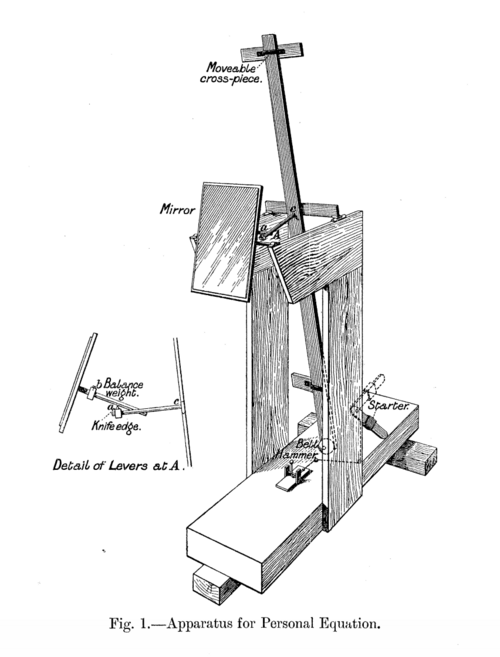
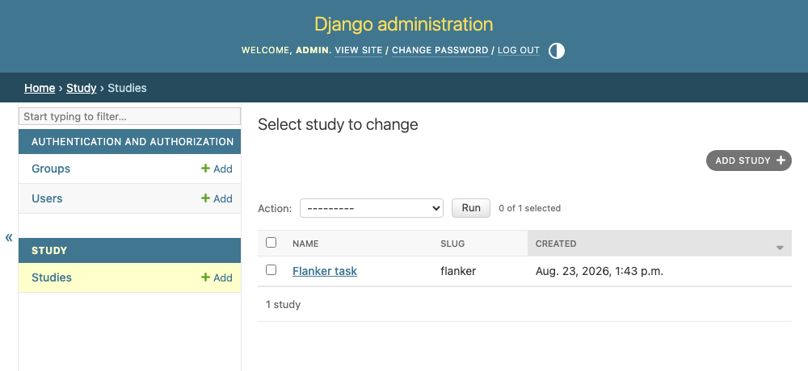

# 1 · Setting up the project

<figure class="apparatus" markdown>

<figcaption markdown="span">
Apparatus for measuring the "[personal equation](https://en.wikipedia.org/wiki/Personal_equation)", each observer's own
reaction-time offset. 
<br>Image: public domain, via [Wikimedia Commons](https://commons.wikimedia.org/wiki/File:Apparatus_for_Personal_Equation.png).
</figcaption>
</figure>

By the end of this chapter you'll have a running Django project with one model, a
`Study`, that you can add to and edit through Django's built-in admin.

## Create the project
Go into your [terminal](https://tutorial.djangogirls.org/en/intro_to_command_line/) and find somewhere you want to save your project (e.g. `~/projects`).
Make a folder, start a `uv` project inside it, then let `uv` and Django make the skeleton of your project for you:

```bash
# somewhere to keep everything
mkdir behavioural-study && cd behavioural-study   

# start a uv project (writes pyproject.toml)
uv init --python 3.14               
              
# add Django as a dependency
uv add "django>=6.1,<6.2"
   
# the project is "config"; the dot keeps manage.py here            
uv run django-admin startproject config .  
       
# our app, where the study code lives
uv run python manage.py startapp study           
```

!!! note "On Windows"
    `mkdir` and `cd` are the same on Windows, but chaining them with `&&` only works in
    the newer [PowerShell 7](https://learn.microsoft.com/powershell/scripting/install/installing-powershell-on-windows)
    (and in the old `cmd.exe`). In Windows PowerShell 5.1, the one that comes with
    Windows, run them as two lines instead:

    ```powershell
    mkdir behavioural-study
    cd behavioural-study
    ```

    Paths differ too, with `~/projects`, becoming `C:\Users\you\projects`.
    Every other command in this tutorial starts
    with `uv run`, and those are identical on Windows, macOS and Linux.

??? question "Why `django-admin` for one command and `manage.py` for the next?"
    They run the same underlying Django machinery, so have two commands looks a bit inconsistent. The reason is
    that `manage.py` doesn't exist yet (`startproject` is the command
    that *creates* this file). So for commands you have to run before you have created your project, use [`django-admin`](https://docs.djangoproject.com/en/6.1/ref/django-admin/);
    everything after (`startapp`, `migrate`, `runserver`), use `manage.py`.

Those commands leave you with this project structure:

```text
behavioural-study/
├── config/                 project-wide settings and URL routing
│   ├── __init__.py
│   ├── asgi.py
│   ├── settings.py         INSTALLED_APPS lives here
│   ├── urls.py             the project's URL map
│   └── wsgi.py
├── study/                  the app you'll build in this tutorial
│   ├── migrations/
│   │   └── __init__.py
│   ├── __init__.py
│   ├── admin.py
│   ├── apps.py
│   ├── models.py
│   ├── tests.py
│   └── views.py
├── .gitignore
├── .python-version
├── main.py                 the sample file from `uv init`; delete it
├── manage.py               how you run Django's commands
├── pyproject.toml          your dependencies
├── README.md
└── uv.lock
```

Note that the `config/` folder holds project-wide settings and how the URLs link up to the separate apps (this is called 'routing'). The `study/`
folder contains the Study app that we'll be developing. We need to tell Django that the study app exists by adding it to
`INSTALLED_APPS` in `config/settings.py`:

<!-- source: config/settings.py -->
```python
INSTALLED_APPS = [
    # ...the built-in apps Django added...
    "study",
]
```

## The first model

A **model** is a Python class that describes a database table. Our first table, Study, is for defining
our studies. Open `study/models.py`. Django created this for you automatically, along with this line of code at the top of the file: 
`from django.db import models`. Below this, add:

```python
--8<-- "study/models.py:study-model"
```

A few things worth noticing:

- Each attribute of the class (name, slug, code, created) becomes a column in our table. A
  [`slug`](https://docs.djangoproject.com/en/6.1/glossary/#term-slug) is the short,
  URL-safe name that will appear in the study's address, like `/study/flanker/`.
- `code` is where the researcher's pasted jsPsych timeline lives. It's a `TextField`
  because it needs to be able to hold a long of characters ([see Django's model field types](https://docs.djangoproject.com/en/6.1/ref/models/fields/#field-types)).
- `__str__` (looks pretty crazy but) is a special method Django looks for automatically whenever it needs to show
  an object as text. It controls how a `Study` shows up in lists (like the admin).
  Without it, you'd see `Study object (1)` (e.g. in the admin section), which is as useful as a kick in the head.

## Wire up the admin

Django autogenerates for you a full admin interface if you spend a moment telling it which models you want to see. In `study/admin.py`:

<!-- source: study/admin.py -->
```python
from django.contrib import admin
from .models import Study

@admin.register(Study)
class StudyAdmin(admin.ModelAdmin):
    list_display = ["name", "slug", "created"]
    prepopulated_fields = {"slug": ["name"]}  # fills in the slug from the name as you type
```

Those seven lines get you the below. A full web interface where you can add, edit, delete rows in your database to your hearts content! Super powerful!

<figure markdown="span">
  { width="620" }
</figure>

!!! note "The admin is only for you!"
    Getting into the admin requires an account with staff status, and what you see there is
    the whole model, laid out Django's way, with the ability to add, delete, and edit. It is better to give collaborators (or participants), a bespoke page containing a form with more limited permissions. To see this in action, check out
    [Registering studies (forms)](advanced/registering-studies.md) in Going further.

## Create the database and log in

The Study model that we made above describes your data relationships. You use `makemigrations` to generate code which is used (via `migrate`) to turn that description into the actual database table. Each time you change your models, you need to make new migration files (via `makemigrations`) and update the database (via `migrate`). This seems tedious, but it's one of Django's great features: [`makemigrations`](https://docs.djangoproject.com/en/6.1/topics/migrations/) writes the migration from your model changes automatically, and because the migration files are committed alongside your code, your database schema travels with the project — anyone who clones it gets the same tables.

```bash
uv run python manage.py makemigrations   # writes the migration file from your model
uv run python manage.py migrate          # applies it to the database
```

Let's also create a login for you and start the server:
```bash
uv run python manage.py createsuperuser  # make yourself an admin login
uv run python manage.py runserver
```

## Checkpoint

Open [http://127.0.0.1:8000/admin/](http://127.0.0.1:8000/admin/), log in, and you'll find **Studies** — the screen you
saw above. 'Add study', give it a name, click save, and observe how the slug is filled in automatically. You've now got a model, a database table, and a way to edit it.

Next, we make a study actually do something by serving it to the browser.
