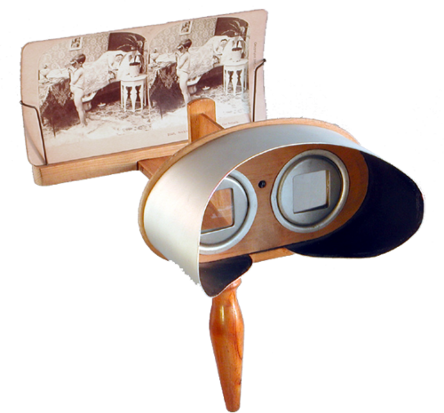
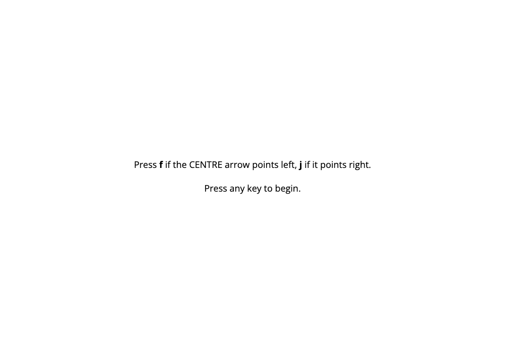
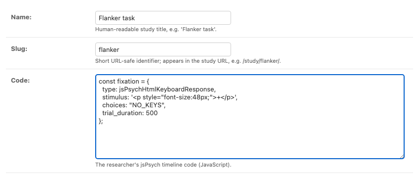

# 2 · Serving the experiment

<figure class="apparatus" markdown>

<figcaption markdown="span">
A stereoscope presented a prepared image to the viewer.
<br>Image: [Wikimedia Commons](https://commons.wikimedia.org/wiki/File:Holmes_Stereoscope_1861.png), CC0.
</figcaption>
</figure>


**By the end of this chapter** a real jsPsych study will run in the browser, served by
your Django app.

<figure markdown="span">
  { width="520" }
  <figcaption>The seeded Flanker task, served from /study/flanker/.</figcaption>
</figure>

## The plan

We need: 

1. a directory to hold jsPsych
2. a view that is called when someone visits your URL suffixed with `/study/<slug>/`
3. a template that combines the researcher's timeline code with jsPsych to run your study

## Keep jsPsych local

Download the
[jsPsych library files](https://www.jspsych.org/latest/tutorials/hello-world/#option-2-download-and-host-jspsych)
and drop them into `study/static/study/jspsych/`.

??? warning "Why `study/static/study/` and not just `study/static/`?"
    That doubled-up folder name looks like a mistake -- it's not! Django searches every app's static directory as one shared namespace and uses
    the **first** file it finds in a specific subfolder. The same rule applies when
    `collectstatic` gathers files for deployment: it copies the first match and ignores
    later files with the same path. If two apps both shipped
    `jspsych.js` directly in their `static/` folder, Django could not distinguish between
    them, and which file won would depend on the order in which its static-file finders
    searched those locations.

    Putting the files inside a second folder named after the app gives every file a unique
    path (`study/jspsych/jspsych.js`), so there's nothing to collide. Django's own
    tutorial explains this under
    ["Static file namespacing"](https://docs.djangoproject.com/en/6.1/intro/tutorial06/#customize-your-app-s-look-and-feel).

They end up here:

```text
study/
└── static/
    └── study/
        └── jspsych/
            ├── jspsych.css                       the look of the trials
            ├── jspsych.js                        the core library
            ├── survey.min.css                    styles for the survey plugin
            ├── plugin-animation.js               one file per trial type…
            ├── plugin-audio-button-response.js
            ├── …                                 (53 of them)
            └── plugin-visual-search-circle.js
```

jsPsych loads each **[trial type](https://www.jspsych.org/v8/overview/plugins/) from its own plugin file**. A timeline can only
use the trial types whose plugin files the page has loaded.

That's easy in a standalone experiment, where you know your own trial types and add a
`<script>` for each. A platform though needs to take into account that a future study may require any of the plugins...

So we add all of them, and (for the time being) we load all of them for each study (there's a note below though on how to build a system to only load in modules that are needed for a given study). Copy every `plugin-*.js` into the jspsych folder.

??? tip "Getting all 53 files"
    The [release download](https://github.com/jspsych/jsPsych/releases) is a zip of the
    core library plus 42 of the plugins. The other 11 (`survey-text`, the `video-*` set,
    `virtual-chinrest`, `visual-search-circle` and the `webgazer-*` set) are published
    only as [separate packages](https://www.jspsych.org/v8/plugins/list-of-plugins/), so if
    you want them you'll need to fetch those individually.

    One exception is worth knowing about. At **1.3 MB**, `plugin-survey.js` is almost five
    times larger than all the other plugins combined (269 KB) because it includes the
    complete [SurveyJS library](https://surveyjs.io/form-library/documentation/overview).
    Our load-everything approach means every participant
    downloads it, even when a study does not use surveys. That is the trade-off for avoiding
    per-study plugin lists.

## The view

Open `study/views.py`.

First add the below imports to the file (we'll add to them as the chapters go on).
The `jspsych` file is one we'll make at the end of this chapter.

```python
from django.shortcuts import render, get_object_or_404

from .jspsych import plugin_files
from .models import Study
```


Then lets add a view that looks up the study by its slug and sends the study (and other information) to a template:

```python
--8<-- "study/views.py:study-detail-view"
```

Don't worry about the `participant_id` and `condition` lines yet as we cover that later. For now
the important part is the last line where we find the study and render a template with it.

Next, we need to **create
`study/urls.py`** and add the below to it:

<!-- source: study/urls.py -->
```python
from django.urls import path

from . import views

app_name = "study"

urlpatterns = [
    path("study/<slug:slug>/", views.study_detail, name="detail"),
]
```
Above, see `<slug:slug>`; that's a placeholder. A request for `/study/flanker/` sets
`slug` to `"flanker"`, and this is sent to the view in the `slug` parameter.

One easy thing to miss: the project doesn't know your app's `urls.py` exists until you
include it. In `config/urls.py`, add the `include`:

<!-- source: config/urls.py -->
```python
from django.urls import include, path

urlpatterns = [
    path("admin/", admin.site.urls),
    path("", include("study.urls")),   # hand every non-admin URL to the study app
]
```

Think of `config/urls.py` as the entry-way to your app. Django checks every incoming URL against the patterns there first. The admin pattern handles `/admin/`, while `include()` passes the
remaining path to `study/urls.py` for a more specific match. This two-stage process
keeps each app's routes inside that app. Without the `include()` line, Django never checks
`study/urls.py`, so URLs beginning `/study/` cannot reach our views.

```text
     a participant asks for /study/flanker/
                        │
                        ▼
   ┌─────────────────────────────────────────┐
   │ config/urls.py            THE FRONT DOOR│
   ├─────────────────────────────────────────┤
   │ path("admin/", admin.site.urls)         │
   │ path("", include("study.urls"))         │
   └─────────────────────────────────────────┘
                        │
    nothing matches /admin/, so the catch-all
     include hands the URL to the study app
                        │
                        ▼
   ┌─────────────────────────────────────────┐
   │ study/urls.py         THE APP'S OWN MAP │
   ├─────────────────────────────────────────┤
   │ path("study/<slug:slug>/", study_detail)│
   └─────────────────────────────────────────┘
                        │
             match! slug = "flanker"
                        │
                        ▼
   views.study_detail(request, slug="flanker")
```

Django tries the patterns in order and stops at the first that matches.

## The template

The view above renders `study/study_detail.html`. Lets make that now.
Templates live in a `templates/` folder inside the app. **create
`study/templates/study/study_detail.html`** and add the below.

<!-- source: study/templates/study/study_detail.html -->
```html
<script src=""></script>
<script src=""></script>

<script>
    const jsPsych = jsPsychModule.initJsPsych({ /* ...on_finish, chapter 4... */ });
    let timeline = [];

    {{ study.code|safe }}   {# the researcher's pasted timeline goes here #}

    jsPsych.run(timeline);
</script>
```

In a nutsheel, the plan is that our platform loads `jsPsych`. You, the researcher then provide the code that fills a space for the jspysch timeline, replacing `{{ study.code|safe }}` shown above.

### Which plugins to load

In this tutorial we load all the `jspsych_plugins` so they are available for whatever study
the researcher has designed. To achieve this, the app reads the plugin folder and hands the
template every file it finds. **Create `study/jspsych.py`**:
    
```python
--8<-- "study/jspsych.py:plugin-files"
```

??? tip "Could we load only the plugins each study uses?"
    Absolutely. Give `Study` a `plugins` field (a
    `JSONField` holding a list of filenames) and this shows the files as a tick-list on
    the admin form. We only load the files ticked in the admin form. An empty
    selection would mean "load everything", so a half-drafted study still runs.

    Via this method, a study page currently carries about **2.4 MB**: the 53 plugins
    (1.6 MB, of which `plugin-survey.js` alone is 1.3 MB), the core library (77 KB) and the
    two stylesheets (770 KB). The seeded Flanker task uses exactly one trial type, so
    picking plugins would serve it in **544 KB** — a saving of roughly **1.9 MB**.

    Why not build that here? It would add about 70 lines across the model, a custom admin
    form, a helper, and a migration. More importantly, researchers would have to
    select the right plugins for their study, and miss  one out and the experiment fails to run.

    Note that if you never use surveys, you can just remove
    `plugin-survey.js` and `survey.min.css` from `study/static/study/jspsych/`, reducing page load from 2.4 MB to **810 KB**.

## Add some studies

Start the server:

```bash
uv run python manage.py runserver
```

open [http://127.0.0.1:8000/admin/](http://127.0.0.1:8000/admin/), log in with the superuser you made in chapter 1, and
click **Studies → Add study**. Fill in three fields:

- Name — `Flanker task`
- Slug — `flanker`, which fills itself in as you type the name (this is the `/study/flanker/` part of the address)
- Code — paste one of the timelines below

<figure markdown="span">
  { width="620" }
  <figcaption markdown="span">Adding the Flanker task. The slug fills itself in from the
  name, and `code` takes the timeline as-is.</figcaption>
</figure>


Save it, and the study is live at `http://127.0.0.1:8000/study/flanker/`.

??? example "Flanker task — `study/seed_studies/flanker.js`"
    Respond to the centre arrow while the flanking arrows agree (`<<<<<`) or disagree
    (`>><>>`) with it. Uses one plugin, `html-keyboard-response`.

    ```javascript
    --8<-- "study/seed_studies/flanker.js"
    ```

??? example "Stroop task — `study/seed_studies/stroop.js`"
    Name the ink colour of a colour word, where word and ink match or clash. Also one
    plugin, `html-keyboard-response`.

    ```javascript
    --8<-- "study/seed_studies/stroop.js"
    ```
??? note "I've found a jsPsyc study on the web. What code do I copy from it to get it work here?"
    Just the JavaScript that builds your trials, not a whole HTML page. The platform
    already calls `initJsPsych()` and `jsPsych.run(timeline)` for you, so your code should
    push its trials onto the `timeline` that's already there and leave the setup alone.

    A standalone experiment that starts like this:

    ```javascript
    const jsPsych = initJsPsych();
    const timeline = [instructions, trial];
    jsPsych.run(timeline);
    ```

    becomes just this when pasted in:

    ```javascript
    timeline.push(instructions, trial);
    ```


Open `http://127.0.0.1:8000/study/flanker/`. You should get the instructions screen from
the top of this chapter; press a key and the trials begin. That's your Django backend
serving a live jsPsych experiment.

The study now runs, but we don't yet know *who* is doing the study. That's what we explore next.
