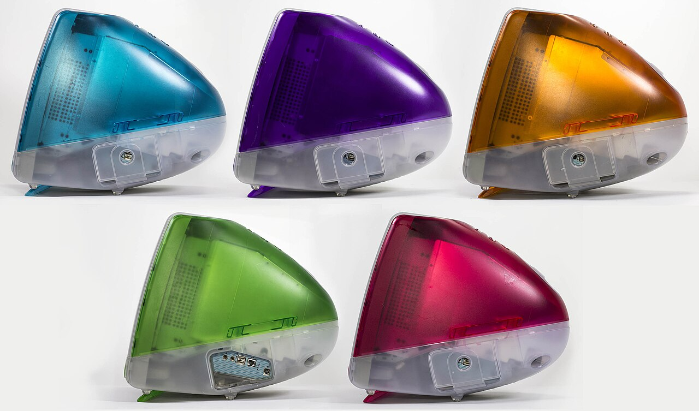

# 3 · Identifying participants

<figure class="apparatus" markdown>

<figcaption markdown="span">
The five "flavours" of the iMac G3, 1999. Machines like these filled university labs
around the turn of the century, running experiments through packages such as
[PsyScope](https://en.wikipedia.org/wiki/PsyScope) and
[SuperLab](https://www.cedrus.com/superlab/). Or
[DMDX](https://psy1.psych.arizona.edu/~jforster/dmdx.htm), if you were more of a PC user
like me back then.
<br>Image: Stephen Hackett, CC BY-SA 4.0, via [Wikimedia Commons](https://commons.wikimedia.org/wiki/File:Imac_G3_5_flavors_side_lineup.jpg).
</figcaption>
</figure>

??? note "Remember DMDX and PsyScope?"
    If you were in a lab around 2000, one of these was probably how you built a study:

    - [DMDX](https://psy1.psych.arizona.edu/~jforster/dmdx.htm) on Windows, written by
      Jonathan and Kenneth Forster and still in use, which got millisecond timing out of a
      PC by talking to the display hardware
      ([Forster & Forster, 2003](https://doi.org/10.3758/BF03195503)).
    - [PsyScope](https://en.wikipedia.org/wiki/PsyScope) on the Mac, where you
      assembled a trial by dragging boxes around instead of writing code — remarkable for
      1993, and the reason a generation of psychologists owned a Mac
      ([Cohen, MacWhinney, Flatt & Provost, 1993](https://doi.org/10.3758/BF03204507)).
    - [SuperLab](https://www.cedrus.com/superlab/) and
      [E-Prime](https://pstnet.com/products/e-prime/), the commercial options. Both are still sold today.


**By the end of this chapter** the study will know who is doing it and which condition
they're in, read from the URL 🔗.

## Two kinds of URL parameter

Look at a real study link:

```
/study/flanker/?participant_id=p01&condition=A
```

There are two things going on here:

- `flanker` is a **path parameter**. It's part of the address itself, and it's how the
  URL pattern picks the study. This is the `<slug:slug>` we encountered in the last chapter.
- `participant_id` and `condition` are **query parameters**, the `key=value` pairs after
  the `?`. They carry extra information *about* this particular visit.

Recruitment tools like [Prolific](https://www.prolific.com/) add such query parameters to your study url (unique for each participant), allowing you to know who has done your study and thus who to pay!

## Read query parameters on the server

You could read query parameters in the participant's browser via JavaScript
([`URLSearchParams`](https://developer.mozilla.org/en-US/docs/Web/API/URLSearchParams)). I'd rather achieve the same thing in the backend using python as we already need to do related tasks here. Keeping similar logic in the same place reduces complexity ([see the KISS computer science principle](https://en.wikipedia.org/wiki/KISS_principle)), which is always a good thing.

Back in `study/views.py`, `study_detail` grows two lines:

```python
--8<-- "study/views.py:study-detail-view"
```

See how `request.GET` holds various key pieces of information. From there we can look up `participant_id` and `condition` (defaulting to an empty string if they're missing) and put each one in the context as its own variable.

## Hand the extracted query parameters as variables to the front-end

See how in the template the python variables we just defined are passed to JavaScript variables:

<!-- source: study/templates/study/study_detail.html -->
```javascript
const PARTICIPANT_ID = "{{ participant_id|escapejs }}";
const CONDITION = "{{ condition|escapejs }}";
```

??? note "What `escapejs` is doing there"
    Both of those values originate from the URL, so they came from whoever wrote the link, and they could have been manipulated to run dodgy code. [`escapejs`](https://docs.djangoproject.com/en/6.1/ref/templates/builtins/#escapejs)rewrites quotes, backslashes, square brackets
    and newlines as `\uXXXX` escapes, so the such code cannot run.

## Where the Prolific IDs come from

When you set your study up on Prolific, you
paste your study URL with Prolific's **placeholders**, and Prolific fills them in per
participant:

```
https://your-site.example/study/flanker/?participant_id={}&condition=A
```

Prolific swaps `{}` for each participant's real ID. In [chapter 4](04-capturing-data.md), at the end of the study we send participants back to Prolific so their submission is recorded as complete.

Prolific also passes `{}` and,`{}`. We only read `participant_id` here. Note that `SESSION_ID` offers a security measure to check if particpants manipulated the urls provided by prolific (for more, see [*Secure external URL*](https://researcher-help.prolific.com/en/articles/445133-recording-prolific-id-s)).
