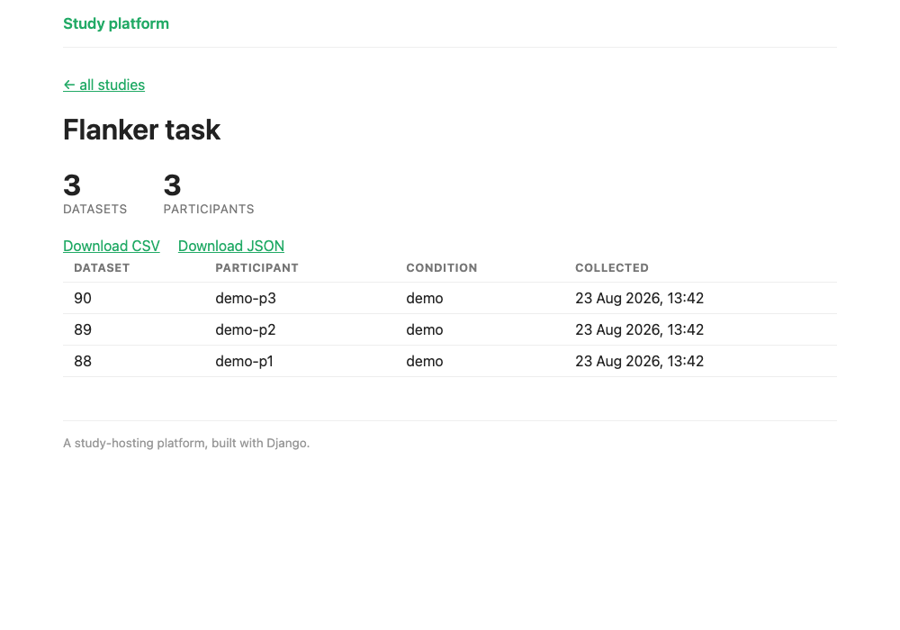

# 4 · Capturing the data

**By the end of this chapter**, when a participant finishes a study, their data will be stored and they will be thanked for completing the study.

<figure markdown="span">
  { width="620" }
  <figcaption>Where we're heading: data landing in the database, ready to browse and export.</figcaption>
</figure>


```
participant finishes the study
        │
        └── POST /api/study/<slug>/data  (JSON) ──►  Django view ──► database (one StudyData row)
```

## The idea

<figure class="apparatus" markdown>

<figcaption markdown="span">
Bluma Zeigarnik in 1921, a few years before the [work](https://en.wikipedia.org/wiki/Zeigarnik_effect) that carries her name. She showed
that people remember an *interrupted* task better than a completed one. This was prompted, the
story goes, by waiters who could recall an unpaid order in detail and forgot it the moment
the bill was settled.
<br>Photo: Andrey Zeigarnik, public domain, via [Wikimedia Commons](https://commons.wikimedia.org/wiki/File:Bluma_Zeigarnik,_April_3,_1921.jpg).
</figcaption>
</figure>

jsPsych collects data throughout the study and hands it all to Django at once when the
timeline ends, through its `on_finish` [callback](https://developer.mozilla.org/en-US/docs/Glossary/Callback_function). 

??? example "Two advanced points"

    - We send the data as
      [JSON](https://developer.mozilla.org/en-US/docs/Learn_web_development/Core/Scripting/JSON)
      (a popular data format) in a `POST` request. `GET` is for asking; `POST` is for
      sending something to be stored.
    - We leave Django's [CSRF protection](https://docs.djangoproject.com/en/6.1/ref/csrf/)
      switched on. [Cross-site request forgery](https://developer.mozilla.org/en-US/docs/Web/Security/Attacks/CSRF)
      is the trick where another website quietly makes *your* browser send a request to our
      server, riding on the fact that your browser attaches your cookies to it. The defence is
      a secret token that Django puts in the page and expects back with every `POST`: another
      site can make your browser send a request, but it can't read our page to find the token.

## The models data is stored in

We have two models: `study/models.py`:
`Participant` (who did it) and `StudyData` (one participant's whole run, with every trial
in a single field):

```python
--8<-- "study/models.py:capture-models"
```

Create the database tables for them

--8<-- "includes/migrate-reminder.md"

Don't worry too much about concepts such ForeignKeys, `on_delete`
rules and `JSONField`. What matters here is that a `StudyData` row belongs to one study and
one participant, and holds this person's data as JSON. Register them in the admin so you can
see the data land, adding to `study/admin.py`:

<!-- source: study/admin.py -->
```python
from .models import Participant, StudyData

@admin.register(StudyData)
class StudyDataAdmin(admin.ModelAdmin):
    list_display = ["id", "study", "participant", "condition", "created"]
    list_filter = ["study", "condition"]
    readonly_fields = ["study", "participant", "condition", "data", "created"]  # captured data: show it, don't edit it

admin.site.register(Participant)
```

Both of these links are **one-to-many**: a study has many datasets, a participant has many
datasets, and each dataset belongs to exactly one of each. The other kind of link, **many-to-many**,
could be used when study has several owners and each of those researchers run several
studies. For more see: [Study ownership](advanced/study-ownership.md) in the Going further
section adds a `Researcher` model and links it to `Study`.

## The endpoint

Here's the view that receives the data. Add it to `study/views.py`, below `study_detail`.

```python
--8<-- "study/views.py:submit-data-view"
```

Wire it into the app's URLs:

=== "study/urls.py"

    <!-- source: study/urls.py -->
    ```python
    path("api/study/<slug:slug>/data", views.submit_data, name="data"),
    ```

## Sending the data from jsPsych

In the front end, we tell jsPsych what to do when the study finishes: `on_finish` runs the `saveData` function, which posts the collected trials to the endpoint.

<!-- source: study/templates/study/study_detail.html -->
```javascript
function saveData() {
    const message = html => document.body.innerHTML =
        "<div style='text-align:center;margin-top:3em;'>" + html + "</div>";

    message("<p>Saving your data, please don't close this window...</p>");
    return fetch(DATA_URL, {
        method: "POST",
        mode: "same-origin",                       // don't send the CSRF token off-origin
        headers: {"Content-Type": "application/json", "X-CSRFToken": CSRF_TOKEN},
        body: JSON.stringify({
            participant_id: PARTICIPANT_ID,
            condition: CONDITION,
            trials: jsPsych.data.get().values()
        })
    })
        .then(response => {
            if (!response.ok) throw new Error("HTTP " + response.status);  // 4xx/5xx isn't success
            return response.json();
        })
        .then(result => {
            message("<p>Thank you, your data has been saved.</p>");
        })
        .catch(() => {
            // keep the data in the page and let them retry rather than losing the run
            message("<p>Sorry, saving failed.</p>" +
                "<button onclick='saveData()'>Try again</button>");
        });
}

const jsPsych = jsPsychModule.initJsPsych({ on_finish: saveData });
```

## Returning participants to Prolific

On [Prolific](https://www.prolific.com/) a submission has to be marked
**complete** before you approve and the person is paid. The
recommended way to record completion is to redirect the participant to a specific url at Prolific. This is what the `completion_url` field on `Study` is for. Add it to `study/models.py`:

```python
--8<-- "study/models.py:study-flags"
```
Run django migrations.

--8<-- "includes/migrate-reminder.md"

The template adds `completion_url` to the page:

<!-- source: study/templates/study/study_detail.html -->
```javascript
const COMPLETION_URL = "{{ study.completion_url|escapejs }}";
```

and then, once the data is stored, we let the participant know and redirect to Prolific.

<!-- source: study/templates/study/study_detail.html -->
```javascript
.then(result => {
    if (COMPLETION_URL) {
        message("<p>Data saved. Returning you to Prolific…</p>" +
            "<p>If you're not redirected, <a href='" + COMPLETION_URL + "'>click here to finish</a>.</p>");
        setTimeout(function () { window.location = COMPLETION_URL; }, 1500);
    } else {
        message("<p>Thank you, your data has been saved.</p>");
    }
})
```

If you leave `completion_url` blank you just get the thank-you. If we do have a  `completion_url` though, we confirm the save *and* then
auto-redirect (Prolific recommend this). There's a short 1500ms delay so participants see their data was saved. 


## Trying a study without saving

Sometimes you want to run a study and *not* record any data. Add `?preview=1` to the URL achieves this. The server reads `?preview=1` and informs the page not to save data:

<!-- source: study/templates/study/study_detail.html -->
```javascript
const PREVIEW = {{ preview|yesno:"true,false" }};   // set from ?preview=1 in the URL

function saveData() {
    if (PREVIEW) {
        message("<p>Preview finished. This run was <b>not</b> saved to the platform database.</p>");
        return Promise.resolve();   // never POST
    }
    // ...otherwise save as usual
}
```


??? warning "Troubleshooting"
    **`403 Forbidden` when the data posts.** That's CSRF: the token is missing or doesn't
    match. Check that the template renders `{{ csrf_token }}` and that the `fetch` sends
    it in the `X-CSRFToken` header. Don't reach for `@csrf_exempt`. You'd be unplugging a
    smoke alarm to stop it beeping.

    **`405 Method Not Allowed`.** Something sent a `GET`, usually a link or an address-bar
    visit to the API URL. The endpoint only takes `POST`.

    **The data saves but every field is empty.** Check that your jsPsych trials actually
    record data. `jsPsych.data.get().values()` should return populated objects. An empty
    timeline posts empty trials.

## Checkpoint

Run the study, finish it, and you should see *"Thank you, your data has been saved."*
Open the admin at `/admin/`, look under **Study data**, and your run is there, with the
whole trial array in its `data` field.
