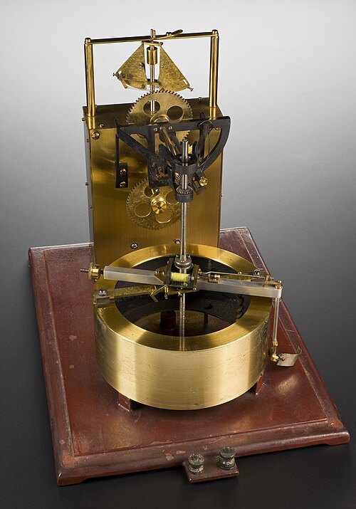
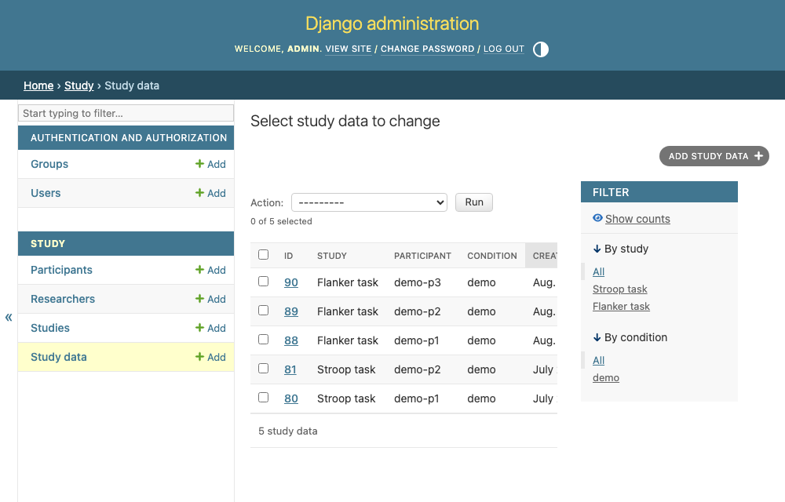

# 5 · Seeing and exporting the data

<figure class="apparatus" markdown>

<figcaption markdown="span">
A kymograph traced data onto a revolving smoked drum.
<br>Photo: Wellcome Collection via [Wikimedia Commons](https://commons.wikimedia.org/wiki/File:Kymograph,_cased,_Europe,_1880-1930._Full_view,_graduated_ma_Wellcome_L0057894.jpg), CC BY 4.0.
</figcaption>
</figure>

**By the end of this chapter** you'll have a researcher dashboard and one-click CSV and
JSON exports.

<figure markdown="span">
  { width="620" }
  <figcaption>The dashboard: counts, a table of datasets, and export links.</figcaption>
</figure>

## Your data in admin

The data is in the database. You can see it in the admin section. You registered `StudyData` back in chapter 4 (below is the code you already added), so you have this ability already!

<!-- source: study/admin.py -->
```python
@admin.register(StudyData)
class StudyDataAdmin(admin.ModelAdmin):
    list_display = ["id", "study", "participant", "condition", "created"]
    list_filter = ["study", "condition"]
```
<figure markdown="span">
  { width="620" }
  <figcaption>The collected runs in the admin, filterable by study and condition.</figcaption>
</figure>


## Your data, pretty
Let's create a purpose-built dashboard and an export tool, which are friendlier than the admin.

!!! warning "These pages are staff-only"
    The dashboard and both exports show participant data, so they're not public. Each view
    is [decorated](https://docs.python.org/3/glossary.html#term-decorator) with `@staff_member_required`, which redirects anyone who isn't a logged-in
    staff user to the admin login first.

## The dashboard

The dashboard view (at the top of this page) counts datasets and participants for one study, and lists the datasets.
Note that we use `select_related("participant")` to fetch each dataset's participant in the *same* query, instead of one extra query per row (which can really slow things down).

## Export to CSV

Another view in `study/views.py`:

```python
--8<-- "study/views.py:export-csv-view"
```

Read the comments and you'll see we have one row per trial (long format, popular in modern statistics), with fixed columns over all participants.

Here's what that produces for two participants who did three trials each:

```text
dataset_id,participant_id,condition,collected,trial_row,correct,plugin_version,response,rt,trial_index,trial_type
1,p01,congruent,2026-08-18T20:20:01.119282+00:00,0,True,2.1.0,f,412,0,html-keyboard-response
1,p01,congruent,2026-08-18T20:20:01.119282+00:00,1,False,2.1.0,j,526,1,html-keyboard-response
1,p01,congruent,2026-08-18T20:20:01.119282+00:00,2,True,2.1.0,f,389,2,html-keyboard-response
2,p02,incongruent,2026-08-18T20:20:01.119452+00:00,0,True,2.1.0,j,603,0,html-keyboard-response
2,p02,incongruent,2026-08-18T20:20:01.119452+00:00,1,False,2.1.0,f,571,1,html-keyboard-response
2,p02,incongruent,2026-08-18T20:20:01.119452+00:00,2,True,2.1.0,j,498,2,html-keyboard-response
```

Drop unnecessary columns (for analysis anyway!) and the data is easier to digest:

| participant_id | condition | trial_row | response | rt | correct |
| --- | --- | --- | --- | --- | --- |
| p01 | congruent | 0 | f | 412 | True |
| p01 | congruent | 1 | j | 526 | False |
| p01 | congruent | 2 | f | 389 | True |
| p02 | incongruent | 0 | j | 603 | True |
| p02 | incongruent | 1 | f | 571 | False |
| p02 | incongruent | 2 | j | 498 | True |

One row per *trial*. This is **long
format**, as popular in r. 

Two of those columns look similar but most certainly are not. `trial_row` is where the trial sat in
the data we received, while `trial_index` comes from jsPsych, which stamps a trial_index value onto every trial
it records (preserving trial order). On a straightforward study
they're the same number. Repeat a block of trials, or filter the data before posting it, and they
diverge, so the export includes both variables.

Behavioural studies collect arbitrary text, and a free-text answer starting with `=`, `+`,
`-` or `@` (even after leading whitespace) could be read as a formula if someone opens the
file in a spreadsheet. So the exporter prefixes those cells with an apostrophe, which a
spreadsheet shows as plain text.

Note that Django typically records times in UTC (see
[time zones](https://docs.djangoproject.com/en/6.1/topics/i18n/timezones/) if you want to
change that), so it may look a few hours off from your local clock. You can convert to
local time in your analysis if you need to.


## Checkpoint

Run the study a couple of times, then open `/study/flanker/dashboard/`. You'll see the
counts climb and the datasets listed, with **Download CSV** and **Download JSON** links
that hand you the data.
