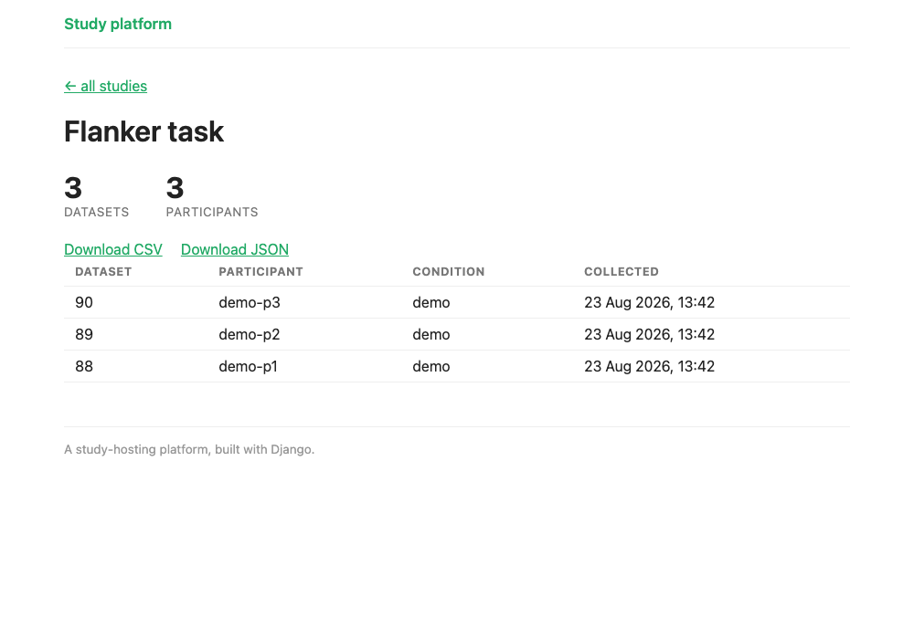
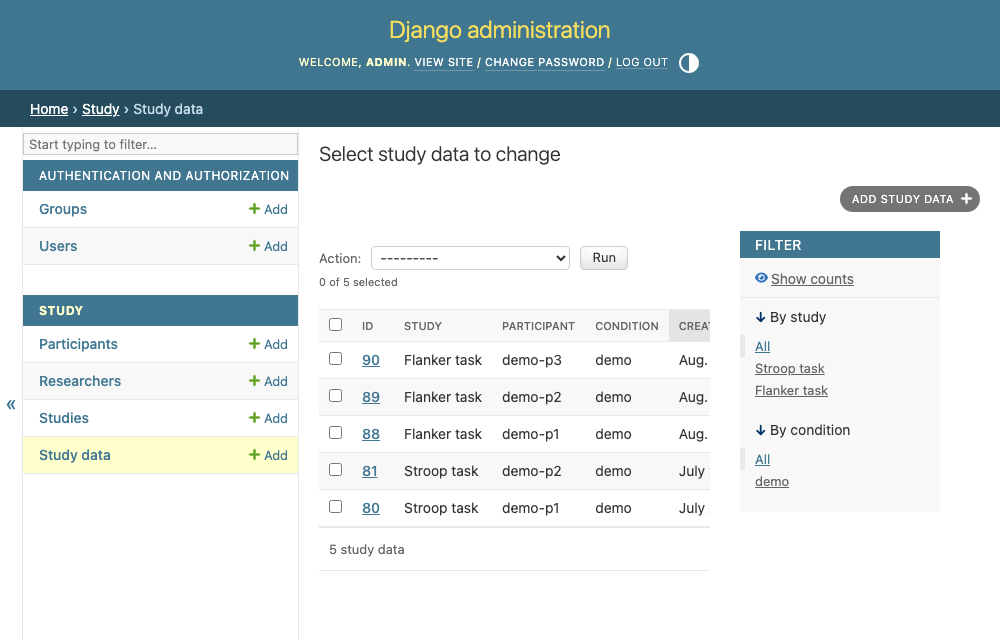

# 5 · Seeing and exporting the data

<span class="time-pill">About 30 minutes</span>

<figure class="apparatus" markdown>

<figcaption markdown="span">
A [kymograph](https://en.wikipedia.org/wiki/Kymograph) traced data onto a revolving smoked drum: pulse, breathing, muscle twitches and reaction times, each as a wavy line.
<br>Photo: Wellcome Collection via [Wikimedia Commons](https://commons.wikimedia.org/wiki/File:Kymograph,_cased,_Europe,_1880-1930._Full_view,_graduated_ma_Wellcome_L0057894.jpg), CC BY 4.0.
</figcaption>
</figure>

**By the end of this chapter** you'll have a researcher dashboard and one-click CSV and
JSON exports.

<figure markdown="span">
  { width="620" }
  <figcaption markdown="span">The dashboard: counts, a table of datasets, and export links. This screenshot has the optional styling from [Sharing page layout](advanced/base-template.md); the version you build in this chapter is plain, unstyled HTML.</figcaption>
</figure>

## Your data in admin

The data is in the database. You can see it in the admin section. You registered `StudyData` back in chapter 4 (below is an excerpt of the code you already added; there's nothing to change), so you have this ability already!

<!-- source: study/admin.py -->
```python
@admin.register(StudyData)
class StudyDataAdmin(admin.ModelAdmin):
    list_display = ["id", "study", "participant", "condition", "created"]
    list_filter = ["study", "condition"]
```
<figure markdown="span">
  { width="620" }
  <figcaption>The collected runs in the admin, filterable by study and condition. The sidebar also lists Researchers, which come from the optional Study ownership lesson.</figcaption>
</figure>


## Your data, pretty
Let's create a purpose-built dashboard and an export tool, which are friendlier than the admin.

!!! warning "These pages are staff-only"
    The dashboard and both exports show participant data, so they're not public. Each view
    is [decorated](https://docs.python.org/3/glossary.html#term-decorator) with `@staff_member_required`, which redirects anyone who isn't a logged-in
    staff user to the admin login first.

## The dashboard


These views need some more imports. Make the top of `study/views.py` read:

<!-- source: study/views.py -->
```python
import csv
import json

from django.contrib.admin.views.decorators import staff_member_required
from django.http import HttpResponse, HttpResponseBadRequest, JsonResponse
from django.shortcuts import get_object_or_404, render
from django.views.decorators.http import require_POST

from .jspsych import plugin_files
from .models import Participant, Study, StudyData
```

Now add the dashboard view to `study/views.py`:

```python
--8<-- "study/views.py:dashboard-view"
```


The dashboard view above counts datasets and participants for one study, and lists the datasets.
Note that we use `select_related("participant")` to fetch each dataset's participant in the *same* query, instead of one extra query per row (which can really slow things down).


It renders a template. **Create `study/templates/study/dashboard.html`**:

<!-- source: study/templates/study/dashboard.html -->
```html
<!DOCTYPE html>
<html lang="en">
<head>
    <meta charset="utf-8">
    <title>{{ study.name }} data</title>
</head>
<body>
  <h1>{{ study.name }}</h1>

  <p>{{ n_datasets }} dataset{{ n_datasets|pluralize }} from {{ n_participants }} participant{{ n_participants|pluralize }}</p>

  <p>
    <a href="">Download CSV</a>
    <a href="">Download JSON</a>
  </p>

  <table>
    <thead>
      <tr><th>Dataset</th><th>Participant</th><th>Condition</th><th>Collected</th></tr>
    </thead>
    <tbody>
      
        <tr>
          <td>{{ dataset.pk }}</td>
          <td>{{ dataset.participant.external_id|default:"–" }}</td>
          <td>{{ dataset.condition|default:"–" }}</td>
          <td>{{ dataset.created|date:"j M Y, H:i" }}</td>
        </tr>
      
        <tr><td colspan="4">No data collected yet.</td></tr>
      
    </tbody>
  </table>
</body>
</html>
```

`pluralize` adds an "s" unless the number is 1. `` repeats its rows once per dataset, and `` covers the case where
there are none yet. The screenshot at the top of the page is the finished app's version,
which adds some styling through a shared layout (see
[Sharing page layout](advanced/base-template.md) in Going further).


## Export to CSV

Another view for `study/views.py`. The helper `_csv_cell` at the bottom of the block goes in too:

```python
--8<-- "study/views.py:export-csv-view"
```

Read the comments and you'll see we have one row per trial (long format, popular in modern statistics), with fixed columns over all participants.

Here's what that produces for two participants who did three trials each (simplified: a real Flanker run records more columns):

```text
dataset_id,participant_id,condition,collected,trial_row,correct,plugin_version,response,rt,trial_index,trial_type
1,p01,A,2026-08-18T20:20:01.119282+00:00,0,True,2.1.0,f,412,0,html-keyboard-response
1,p01,A,2026-08-18T20:20:01.119282+00:00,1,False,2.1.0,j,526,1,html-keyboard-response
1,p01,A,2026-08-18T20:20:01.119282+00:00,2,True,2.1.0,f,389,2,html-keyboard-response
2,p02,B,2026-08-18T20:20:01.119452+00:00,0,True,2.1.0,j,603,0,html-keyboard-response
2,p02,B,2026-08-18T20:20:01.119452+00:00,1,False,2.1.0,f,571,1,html-keyboard-response
2,p02,B,2026-08-18T20:20:01.119452+00:00,2,True,2.1.0,j,498,2,html-keyboard-response
```

Drop unnecessary columns (for analysis anyway!) and the data is easier to digest:

| participant_id | condition | trial_row | response | rt | correct |
| --- | --- | --- | --- | --- | --- |
| p01 | A | 0 | f | 412 | True |
| p01 | A | 1 | j | 526 | False |
| p01 | A | 2 | f | 389 | True |
| p02 | B | 0 | j | 603 | True |
| p02 | B | 1 | f | 571 | False |
| p02 | B | 2 | j | 498 | True |

One row per *trial*. This is the **long
format** that R and pandas expect.

Two of those columns look similar but most certainly are not. `trial_row` is where the trial sat in
the data we received, while `trial_index` comes from jsPsych, which stamps a `trial_index` value onto every trial
it records (preserving trial order). They normally match, including when a block of
trials repeats. Filtering out trials before posting the data can make them differ, so the export
includes both variables.

Behavioural studies collect arbitrary text, and a free-text answer starting with `=`, `+`,
`-` or `@` (even after leading whitespace) could be read as a formula if someone opens the
file in a spreadsheet. So the exporter prefixes those cells with an apostrophe, which a
spreadsheet shows as plain text.

Note that Django typically records times in UTC (see
[time zones](https://docs.djangoproject.com/en/6.1/topics/i18n/timezones/) if you want to
change that), so it may look a few hours off from your local clock. You can convert to
local time in your analysis if you need to.


## Export to JSON

CSV flattens every run into trials. JSON keeps each run whole, with its trials nested
inside it, which is handy if you'd rather do the reshaping in R or Python. Add this last
view to `study/views.py`:

```python
--8<-- "study/views.py:export-json-view"
```

## Wire up the URLs

None of these three views has an address yet. Add them to the `urlpatterns` list in
`study/urls.py`:

<!-- source: study/urls.py -->
```python
    path("study/<slug:slug>/dashboard/", views.dashboard, name="dashboard"),
    path("study/<slug:slug>/export.csv", views.export_csv, name="export_csv"),
    path("study/<slug:slug>/export.json", views.export_json, name="export_json"),
```

The dashboard template links to the exports by these names, so all three need to be
there before the dashboard will load.


## Checkpoint

Run the study a couple of times, then open `/study/flanker/dashboard/` (you may be asked to log in first, if you have not done so already; the page is staff-only). You'll see the
counts climb and the datasets listed, with **Download CSV** and **Download JSON** links
that hand you the data.
