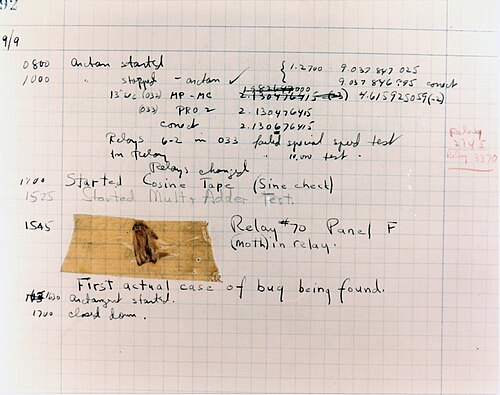

# 6 · Testing what matters

<figure class="apparatus" markdown>

<figcaption markdown="span">
**Then:** the first computer "bug", a moth taped into Harvard's Mark II logbook in 1947.
<br>Image: public domain, via [Wikimedia Commons](https://commons.wikimedia.org/wiki/File:First_Computer_Bug,_1947.jpg).
</figcaption>
</figure>

**By the end of this chapter** you'll have automated tests for the one thing you can't
afford to get wrong: the data-capture endpoint.

## What a test looks like

A Django test sends appropriate inputs to a block of code, runs it, and checks on the result. This is run repeatedly during development to ensure no bugs creep in during development. Here, we write tests for two trials, and confirm one dataset lands in the database with both trials in its `data` field. Tests go in `study/tests.py`, another of the files `startapp` made for you:

```python
--8<-- "study/tests.py:capture-test"
```

Note that:

- `reverse("study:data", ...)` builds the URL from its name instead of hard-coding
  `/api/study/flanker/data`. If you rename your route later on this does not break your test.
- The test database is built afresh each time and thrown away afterwards. Your real data is never touched.

## Test the failures too

We also need to check for failures too, such as:

- a `GET` to the endpoint should be refused (`405`)
- an unknown study should give a `404`
- malformed JSON should give a `400` and not save

## Run them

```bash
uv run python manage.py test
```
Typically tests are run automatically before you update your live server, with any failing tests putting the breaks on your server update... making sure that it is you who find out something has broken, before your participants.
