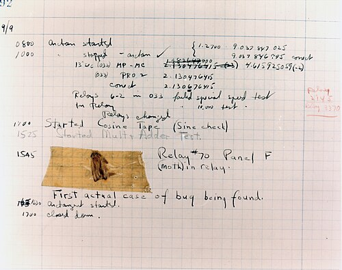

# 6 · Testing what matters

<span class="time-pill">About 15 minutes</span>

<figure class="apparatus" markdown>

<figcaption markdown="span">
**Then:** the first computer "bug", a moth taped into the [Harvard Mark II](https://en.wikipedia.org/wiki/Harvard_Mark_II)'s logbook in 1947.
<br>Image: public domain, via [Wikimedia Commons](https://commons.wikimedia.org/wiki/File:First_Computer_Bug,_1947.jpg).
</figcaption>
</figure>

**By the end of this chapter** you'll have automated tests for the one thing you can't
afford to get wrong: the data-capture endpoint.

## What a test looks like

A Django test sends appropriate inputs to a block of code, runs it, and checks the result. You run your tests again and again as you develop, so bugs can't creep in unnoticed. The first test here posts a submission with two trials and confirms one dataset lands in the database with both trials in its `data` field. Tests go in `study/tests.py`, another of the files `startapp` made for you. Replace what's in it with these imports:


<!-- source: study/tests.py -->
```python
from django.test import TestCase
from django.urls import reverse

from .models import Study, StudyData
```

and then the test class below them:


```python
--8<-- "study/tests.py:capture-test"
```

Note that:

- `reverse("study:data", ...)` builds the URL from its name instead of hard-coding
  `/api/study/flanker/data`. If you rename your route later on this does not break your test
- The test database is built afresh each time and thrown away afterwards. Your real data is never touched
- Because that database starts empty, `setUpTestData` creates the `flanker` study the tests post to. It runs once for the class, and every test starts from that state

## Test the failures too

We need to check failures too, such as:

- a `GET` to the endpoint should be refused (`405`)
- an unknown study should give a `404`
- malformed JSON should give a `400` and not save


Add these inside the same `DataCaptureTests` class, below the first test (keep the
indentation, so they belong to the class):

```python
--8<-- "study/tests.py:failure-tests"
```


## Run them

```bash
uv run python manage.py test
```


You should see `Ran 4 tests` and `OK`. A failing test prints the assertion that broke and
the line it's on. I've put more test examples in the finished app's `study/tests.py`.

Typically tests are run automatically before you update your live server, with any failing test putting the brakes on the update. That way it's you who finds out something has broken, not your participants.

That's the core of the tutorial done. [Chapter 7](07-what-youve-built.md) sums up what you've built and where to take it next.
