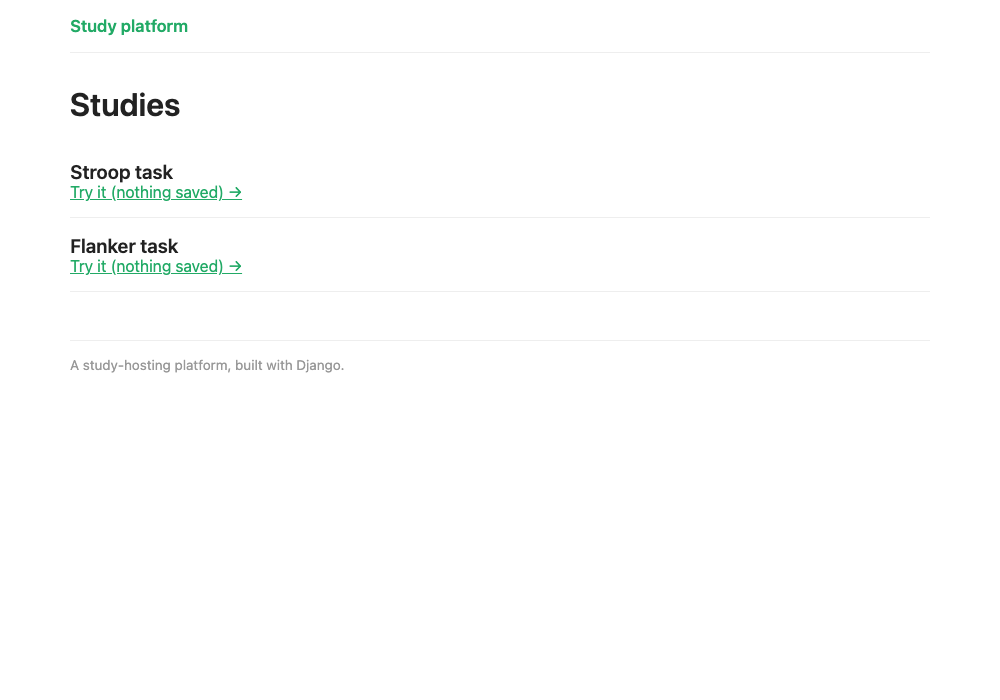

# Sharing page layout: template inheritance

<span class="time-pill">About 25 minutes</span>

In chapter 5 you built an HTML dashboard. Here, you'll add another page that shows a list of studies. Both the dashboard and third new page, use the same header, footer and styling. Rather than copying that shared code into
every page, we use **template inheritance**: the shared code lives once, in `base.html`,
and each page builds on it.

## A studies list

The new page needs a view. Add it to `study/views.py`:

```python
--8<-- "study/views.py:study-list-view"
```

Give it the site's home address by adding this line at the top of the `urlpatterns` list
in `study/urls.py`:

<!-- source: study/urls.py -->
```python
    path("", views.study_list, name="list"),
```

Don't open the page yet: the view renders a template, `study_list.html`, that doesn't exist
yet, so you'd get a `TemplateDoesNotExist` error. That template builds on the shared
layout, `base.html`, so we'll write `base.html` first, then the list's template.

## The base template

`base.html` stores everything the pages have in common, `` marking
the gaps each page can fill (if desired). **Create
`study/templates/study/base.html`**. Most of it is the shared styling:

```html
--8<-- "study/templates/study/base.html"
```

There are 2 mechanisms:

- `` marks a region a child page can override. `base.html` gives each block a
  default (the title falls back to "Study platform"), and a child page replaces it
- `` pulls in a smaller partial. The header and footer live in their own
  little `menu.html` and `footer.html` files, so they're easy to find and reuse

## The header and footer

**Create `study/templates/study/menu.html`**:

```html
--8<-- "study/templates/study/menu.html"
```

and **`study/templates/study/footer.html`**:

```html
--8<-- "study/templates/study/footer.html"
```

`` builds the link from the URL's name, so the header on every page
points back to the studies list.

## A page that extends it

Each page now extends base.html. **Create
`study/templates/study/study_list.html`**:

<!-- source: study/templates/study/study_list.html -->
```html

Studies

  <h1>Studies</h1>
  
    <div class="study">
      <div class="name">{{ study.name }}</div>
      <div class="links">
        <a href="?preview=1">Try it (nothing saved) →</a>
      </div>
    </div>
  
    <p>No studies are currently available.</p>
  

```

``needs to be on every page that extends another.

**Replace the whole of `study/templates/study/dashboard.html`** with the below. It
extends `base.html` too, shows counts, and provide a link back to the list:

```html
--8<-- "study/templates/study/dashboard.html"
```

There's a catch: if you added the Trials column in
[chapter 7's exercise](../07-what-youve-built.md#try-it-yourself-count-the-trials), this will
disappear. To keep it, put back the two lines from the exercise's answer,
`<th>Trials</th>` and `<td>{{ dataset.data|length }}</td>`, and change the empty row's
`colspan="4"` to `colspan="5"`.

The participant's study page, `study_detail.html`, stays a stand-alone file. jsPsych takes
over the whole page, and `saveData` replaces the page body when the study ends, so a site
header and footer would only get in the way.

## Checkpoint

Open [http://127.0.0.1:8000/](http://127.0.0.1:8000/) and you'll see your studies:

<figure markdown="span">
  { width="620" }
  <figcaption markdown="span">The studies list. This one has a Stroop task too; yours lists whatever studies you've added.</figcaption>
</figure>

Then open `/study/flanker/dashboard/`. It now has the same header and footer, and looks like
the screenshot at the top of chapter 5.

