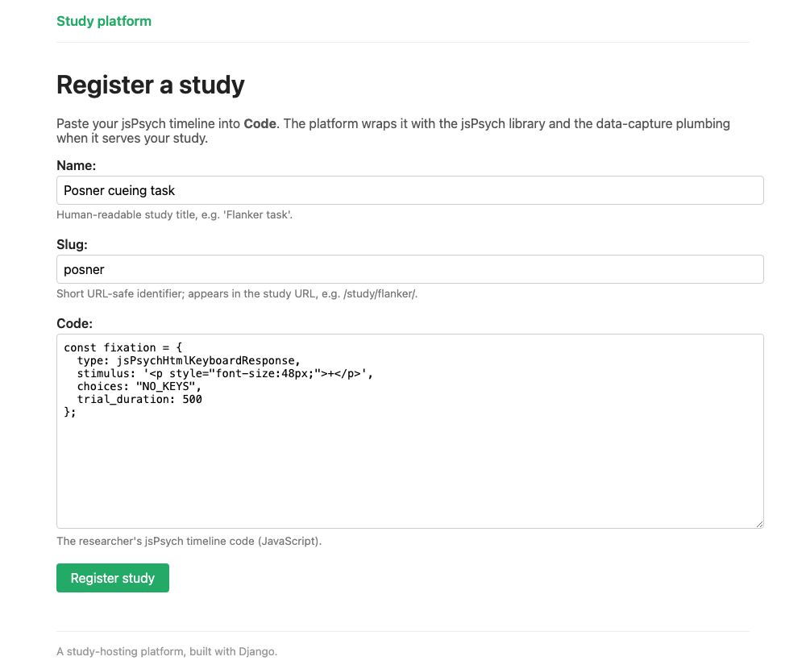
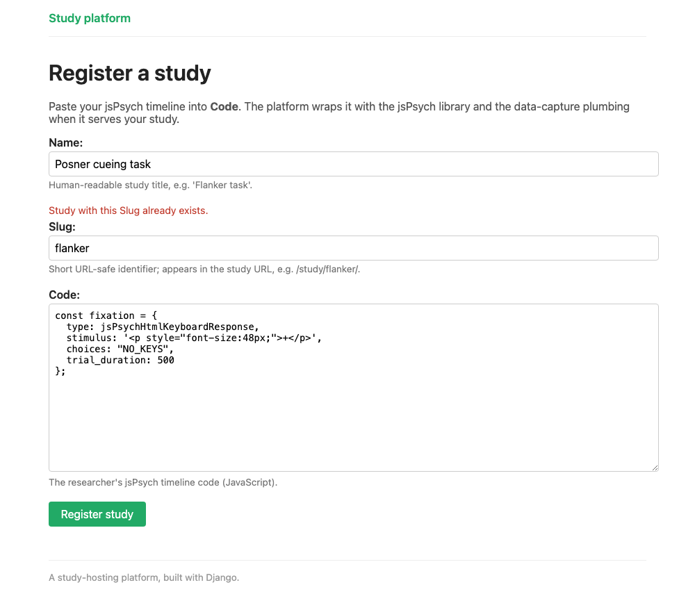

# Registering studies

The admin you wired up in chapter 1 is a staff tool. It's allows you to add/edit/delete fields and is not the right tool to share with your collaborators (or participants).

What you need here is a form.

## A ModelForm

We already have `Study` in `models.py`. A `ModelForm` builds a form based on it, saving you a lot of time. Create
`study/forms.py`:

```python
--8<-- "study/forms.py:study-form"
```

That's it! From those four lines Django works out that:

- `name` is a `CharField(max_length=200)`, so it renders a text input and rejects
  anything over 200 characters
- `slug` is a `SlugField` that's `unique=True`. It does not allow spaces and punctuation can't be the same as any other slugs from other studies already saved
- `code` is a `TextField`, so it renders a textarea
- each field's `help_text` from the model becomes a hint for the user

`fields` is an important line. It's a whitelist: `Study` also has `created`,
`completion_url` and `researchers`, and leaving them out means a visitor can't see or access them. 

## A view for both halves

A form has two states: showing data, and sending data. This one view handles both.

```python
--8<-- "study/views.py:study-create-view"
```

When the page is opened for the first time, request.method == "GET". When someone clicks submit, that data is POSTed to the backend.

- GET (someone opened the page): build an empty form and render it.
- POST (someone submitted the form): build the form *from the submitted data*, and ask it
  `is_valid()`. If yes, `form.save()` writes the row to the database and we redirect. If the data is not valid, we rerender the form with the problematic data alongside useful error messages. 


## A template

`{{ form.as_p }}` is very powerful and generates code to show every field, its label, its help text and any errors.

<!-- source: study/templates/study/study_form.html -->
```html
<form method="post" class="stacked">
  
  {{ form.as_p }}
  <button type="submit">Register study</button>
</form>
```

<figure markdown="span">
  { width="620" }
  <figcaption markdown="span">What those three lines render. Every label, hint and input
  came from the model, by way of the `ModelForm`.</figcaption>
</figure>

`` is required. Django will refuse the POST without it. 

If `as_p` is too coarse, you can render fields one at a time (`{{ form.name.label_tag }}`,
`{{ form.name }}`, `{{ form.name.errors }}`) and lay them out however you like.

## The URL

```python
--8<-- "study/urls.py"
```

Note where `study/new/` sits. URL patterns are matched in order, and `study/<slug:slug>/`
would happily match `/study/new/` and go looking for a study called "new". The specific
pattern goes above the general one.

## Try it

```bash
uv run python manage.py runserver
```

Log in at `/admin/`, then open `http://127.0.0.1:8000/study/new/`. Submit it without entering any data and you'll see the errors that are reported back to the user automatically. Give it a slug
that's already taken (e.g. `flanker`) and the form tells you of this mistake. 

<figure markdown="span">
  { width="620" }
  <figcaption markdown="span">A rejected submission. The values the researcher typed are
  still there, the error sits on the field that caused it, and nothing was saved.</figcaption>
</figure>

## Test it

The form saves data to your database, so it's best to write tests for it:

```python
--8<-- "study/tests.py:form-test"
```

The full set in `study/tests.py` also checks that an anonymous visitor is turned away,
that a taken slug is reported rather than saved, and that the fields left out of `fields`
really are absent from the rendered page.

## Where this goes next

These tools (a `ModelForm`, a view that forks on the method, a template with
``) can be used to build a consent page, a debrief
questionnaire, a demographics form for participants who came in without a recruitment ID.
