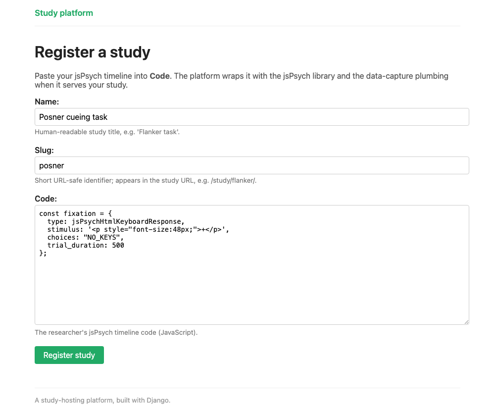
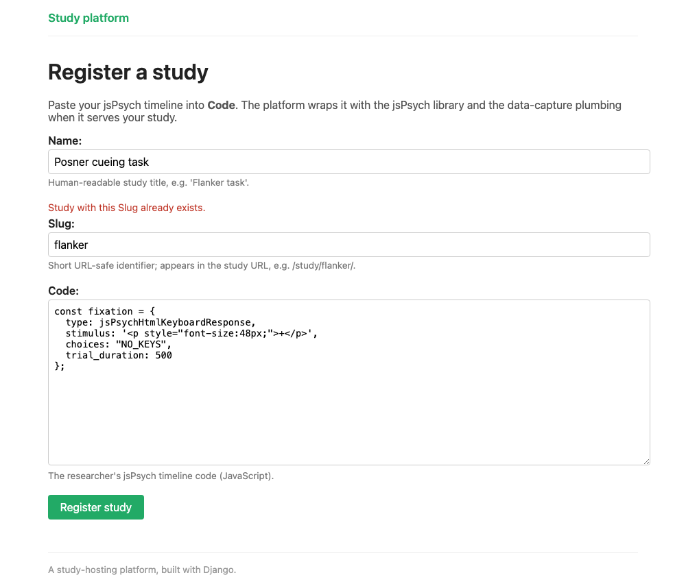

# Registering studies

<span class="time-pill">About 30 minutes</span>

The admin you wired up in chapter 1 is for staff. It lets you add, edit and delete anything in the database, so it isn't the right tool to share with collaborators (or participants).

What you need here is a form.

!!! note "Before you start"
    This page builds on [Sharing page layout](base-template.md): the form's page extends
    `base.html`, and its URLs sit alongside the studies list. Do that lesson first.

## A ModelForm

We already have `Study` in `models.py`. A `ModelForm` builds a form based on it, saving you a lot of time. Create
`study/forms.py` (a new file):

```python
--8<-- "study/forms.py:study-form"
```

That's it! From the `Meta` class Django works out that:

- `name` is a `CharField(max_length=200)`, so it renders a text input and rejects
  anything over 200 characters
- `slug` is a `SlugField` that's `unique=True`. It removes spaces and punctuation, and it can't match the slug of a study that's already saved
- `code` is a `TextField`, so it renders a textarea
- each field's `help_text` from the model becomes a hint for the user

`fields` is a whitelist of fields from`Study` you want to show via the form. 

## A view for both halves

A form does 2 things: it shows data, and it sends data. The view handles both of these scenarios.

It needs two new imports, `redirect` and your `StudyForm`. Make the top of `study/views.py` read:

```python
--8<-- "study/views.py:imports"
```

Then add the view below the others:

```python
--8<-- "study/views.py:study-create-view"
```

`@staff_member_required` makes sure that only staff members can access this view. It is important here: `code` is JavaScript that runs in every participant's browser, so only people you trust should be able to write it (such as collaborators, see [Where this goes next](#where-this-goes-next)).

When the page is opened for the first time, `request.method == "GET"`. When someone clicks submit, `request.method == "POST"`.

- GET (someone opened the page): build an empty form and render it
- POST (someone submitted the form): build the form *from the submitted data*, and ask it
  `is_valid()`. If yes, `form.save()` writes the row to the database and we redirect. If the data is not valid, we rerender the form with the problematic data alongside useful error messages


## A template

`{{ form.as_p }}` is powerful and generates code for every field (label, help text and any errors). **Create `study/templates/study/study_form.html`**:

```html
--8<-- "study/templates/study/study_form.html"
```

<figure markdown="span">
  { width="620" }
  <figcaption markdown="span">What that template renders. Every label, hint and input
  came from the model, by way of the `ModelForm`.</figcaption>
</figure>

`` is required. Django will refuse the POST without it. It's the same protection the study page uses to send its data, explained in [chapter 4a](../04-capturing-data.md#the-idea) (open "Two advanced points"). There, JavaScript sends the token in a header; here, `` adds it to the form as a hidden field, and the browser sends it along with everything else.

If `as_p` is too coarse, you can render fields one at a time (`{{ form.name.label_tag }}`,
`{{ form.name }}`, `{{ form.name.errors }}`) and lay them out however you like.

## The URL

Add this line to `urlpatterns` in `study/urls.py`, **above** the `study/<slug:slug>/` pattern:

<!-- source: study/urls.py -->
```python
    path("study/new/", views.study_create, name="create"),
```

The whole file should now read:

```python
--8<-- "study/urls.py"
```

Note where `study/new/` sits. URL patterns are matched in order, and `study/<slug:slug>/`
would happily match `/study/new/` and go looking for a study called "new". The specific
pattern goes above the general one.

## A link to the form

Right now the only way to reach the form is to type its address. Let's add a link to it on
the studies list. Open `study/templates/study/study_list.html` and add these lines just
below `<h1>Studies</h1>`:

<!-- source: study/templates/study/study_list.html -->
```html

  <p class="links"><a href="">Register a study →</a></p>

```

Participants see the studies list too, so the `` check shows the link
only to logged-in staff. Everyone else sees the page exactly as before.

## Try it

```bash
uv run python manage.py runserver
```


Log in at `/admin/`, then open `http://127.0.0.1:8000/study/new/` (or follow the link from the studies list). Submit it without entering any data and you'll see the errors that are reported back to the user automatically. Give it a slug
that's already taken (e.g. `flanker`) and the form tells you of this mistake. Fill it in properly and you're sent straight to your new study.

<figure markdown="span">
  { width="620" }
  <figcaption markdown="span">A rejected submission. The values the researcher typed are
  still there, the error sits on the field that caused it, and nothing was saved.</figcaption>
</figure>

## Test it

The form saves data to your database, so it's best to write tests for it. The form is staff-only, so the test needs a logged-in staff user. Add `get_user_model` to the imports at the top of `study/tests.py`:

<!-- source: study/tests.py -->
```python
from django.contrib.auth import get_user_model
```

then add this new class at the bottom of the file. `setUp` runs before every test in the class, creating a staff user and logging the test client in as them:

```python
--8<-- "study/tests.py:form-test"
```

Run `uv run python manage.py test` again. You should see `Ran 5 tests` and `OK`.

The full set in `study/tests.py` also checks that an anonymous visitor is turned away,
that a taken slug is reported rather than saved, and that the fields left out of `fields`
really are absent from the rendered page.

## Where this goes next

These tools (a `ModelForm`, a view that forks on the method, a template with
``) can be used to build a consent page, a debrief
questionnaire, or a demographics form for participants who came in without a recruitment ID. To let collaborators register their own studies, give each of them a login and link it to a `Researcher`. Then decide who reviews new code before participants see it.
