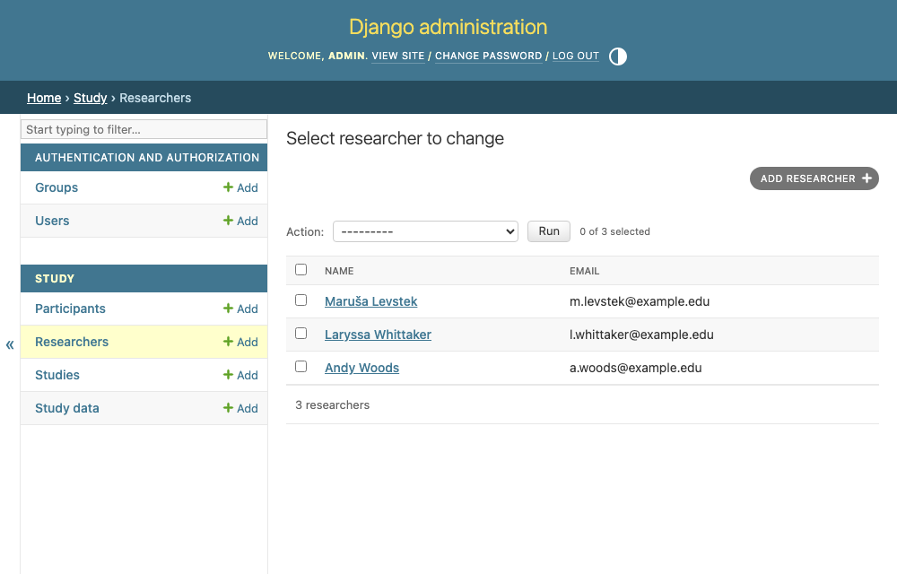
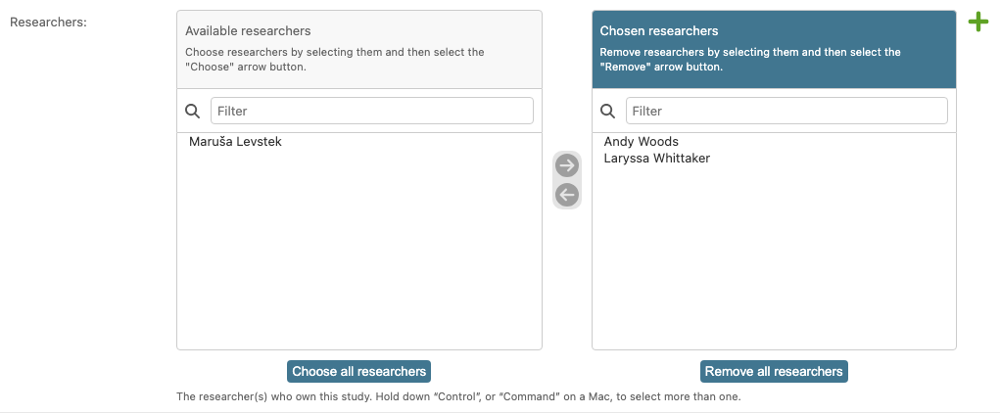

# Study ownership: many-to-many

The relationships we built in chapter 4 are one-to-many: a study has many datasets, and
each dataset belongs to exactly one study. What happens though when a study might be run by two collaborators, and they each might have several other studies with others? Meet the **many-to-many** relationship.

## A model for researchers

Lets create a researcher model in `study/models.py`:

```python
--8<-- "study/models.py:researcher-model"
```

Then we link it to `Study` with a `ManyToManyField`:

```python
--8<-- "study/models.py:researchers-field"
```

That's a new model and a new field, so both need migrating:

--8<-- "includes/migrate-reminder.md"

You don't create a table for this yourself. Django makes a hidden link table,
`study_researchers`, with two foreign keys linking to the appropriate rows on other tables.

```text
     Study                  study_researchers            Researcher
 ┌────┬─────────┐       ┌────┬──────────┬───────────────┐   ┌────┬───────────────────┐
 │ id │ name    │       │ id │ study_id │ researcher_id │   │ id │ name              │
 ├────┼─────────┤       ├────┼──────────┼───────────────┤   ├────┼───────────────────┤
 │  1 │ Flanker │       │  1 │    1     │       1       │   │  1 │ Andy Woods        │
 │  2 │ Stroop  │       │  2 │    1     │       2       │   │  2 │ Laryssa Whittaker │
 └────┴─────────┘       │  3 │    2     │       2       │   │  3 │ Maruša Levstek    │
      ▲                 └────┴────┬─────┴──────┬────────┘   └────┴───────────────────┘
      │                          │            │                  ▲
      └──────────────────────────┘            └──────────────────┘
        study_id → Study.id            researcher_id → Researcher.id
```

Read the middle table a row at a time:

- Row 1 ties **Flanker** (study 1) to **Andy Woods** (researcher 1).
- Row 2 ties **Flanker** again, this time to **Laryssa Whittaker** (2), so one study has two owners.
- Row 3 ties **Stroop** (2) back to **Laryssa Whittaker**, so one researcher owns two studies.

Maruša Levstek (3) has no study as of yet: a researcher with no studies simply has
no rows in the middle table. This is the same arrangement used in the paper's model
diagram.

## Reading a model relationship 'from either end'

Because we set `related_name="studies"`, the relationship reads naturally in both
directions:

```python
study.researchers.all()    # who owns this study
researcher.studies.all()   # what this researcher owns
```

## In the admin

Register `Researcher` and you get the usual admin screens for it, so you can add people
and see who is on the platform:

<!-- source: study/admin.py -->
```python
from .models import Researcher

@admin.register(Researcher)
class ResearcherAdmin(admin.ModelAdmin):
    list_display = ["name", "email"]
```

<figure markdown="span">
  { width="620" }
  <figcaption>The three researchers from the table above, in the admin.</figcaption>
</figure>

Assigning them to a study is the other half. A raw multi-select box for that is miserable
to use once you have more than a handful of researchers, so `filter_horizontal` gives you
the friendlier two-pane picker instead:

<!-- source: study/admin.py -->
```python
@admin.register(Study)
class StudyAdmin(admin.ModelAdmin):
    # ...
    filter_horizontal = ["researchers"]
```

{ width="620" }
