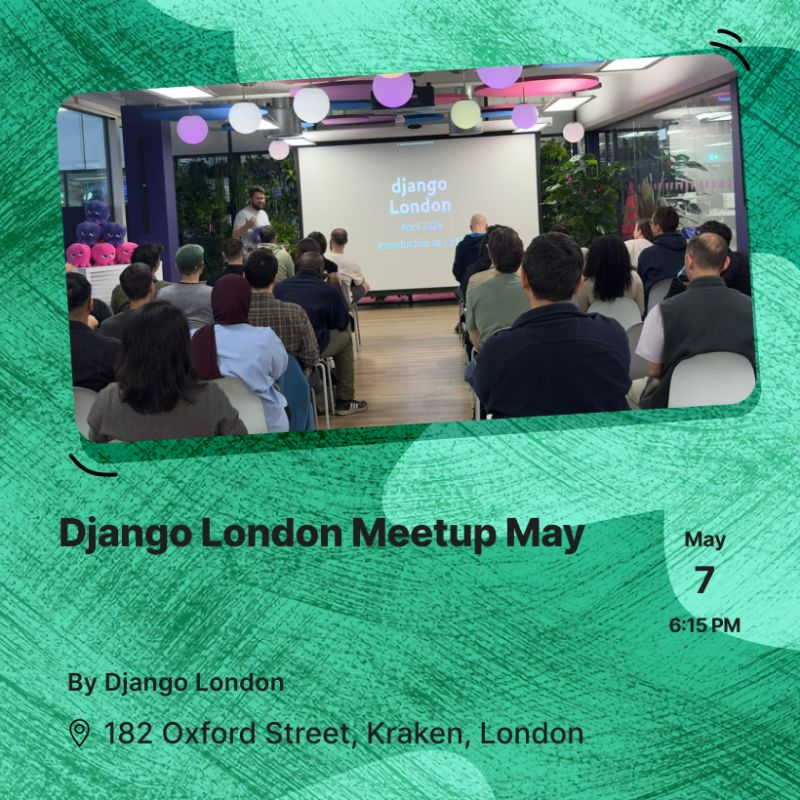

# Django for Behavioural Science

<figure class="apparatus" markdown>

<figcaption markdown="span">
Parts of this tutorial and accompanying manuscript were presented under the title *Django in the Lab*: from live VR studies to WhatsApp diary studies and AI skill tracking, at the
[Django London meetup](https://www.linkedin.com/posts/djangolondon_django-python-londontech-activity-7455164098834665472-YeOz)
on 7 May 2026. Image: Django London.
</figcaption>
</figure>

Plan for around 3 hours to complete this tutorial.

This tutorial is the hands-on companion to the paper
[*First Steps in Django Web Development: Applied Examples from Behavioural Research*](https://osf.io/preprints/psyarxiv/xrm5w_v2)
(Woods, currently under peer review). The paper explores why a behavioural
scientist might want to build their own web application, with examples drawn from
real studies. Here though, is where you actually build an application.

You've built an experiment in jsPsych. It runs great in the browser, but how do you store
your results? When your participant closes the tab, their results poof away! This is the
job of the backend, and this guide shows you how to build such a backend with Django. Think [Pavlovia](https://pavlovia.org) or [Gorilla](https://gorilla.sc/), but utterly bespoke, so you can add just about any
feature you can imagine to make your study more powerful. In one of my own [studies](https://www.frontiersin.org/journals/virtual-reality/articles/10.3389/frvir.2021.807910/full) that
meant wiring in a Raspberry Pi and a webcam, to estimate how many people were milling about a room at key moments.

!!! note "Other Django tutorials"
    These are great. You should check them out too!

    - the [official Django tutorial](https://docs.djangoproject.com/en/6.1/intro/tutorial01/)
    - the [Django Girls tutorial](https://tutorial.djangogirls.org/en/)

## What you'll build

Here we will be building a small study-hosting platform. A researcher adds a study by pasting in their
[jsPsych](https://www.jspsych.org/) timeline. The platform adds data-capture,
serves the study to participants (recruited from [Prolific](https://www.prolific.com/) if
you want that), and stores study data in a database that you can then browse and export.

<figure markdown="span">
  { width="480" }
  <figcaption markdown="span">A seeded [Flanker task](https://en.wikipedia.org/wiki/Eriksen_flanker_task), served by your own Django backend.</figcaption>
</figure>

## A few things to point out

- You can hide the comments code blocks by clicking
<svg style="vertical-align:-.2em;width:1.05em;height:1.05em" viewBox="0 0 24 24" fill="none" stroke="currentColor" stroke-width="2" stroke-linecap="round" stroke-linejoin="round" aria-hidden="true"><path d="M21 15a2 2 0 0 1-2 2H7l-4 4V5a2 2 0 0 1 2-2h14a2 2 0 0 1 2 2z"/></svg> above the code block or in the menu bar.
- Code blocks have a copy button, top-right corner.
- Most blocks have a "… on GitHub" link underneath which takes you to the file in github. 
- Some terms here have dotted lines underline. Hover over, or tap
  this term, for a brief explanation (e.g. slug).
- If you spot a mistake, please let me know! Click on the github button in the menu bar, and in github, click 'issues' (in their menu bar). Thanks!
